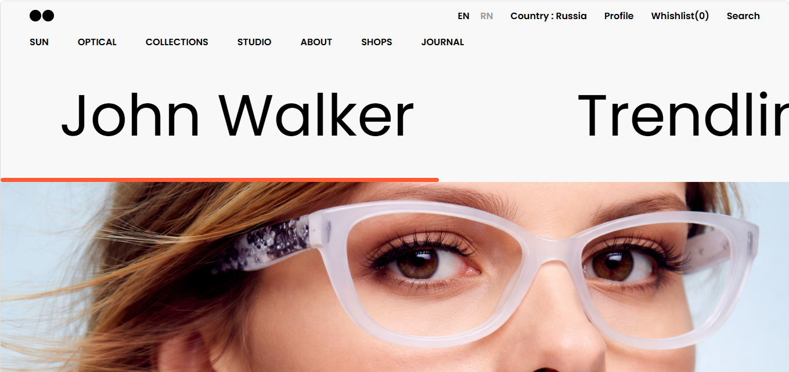
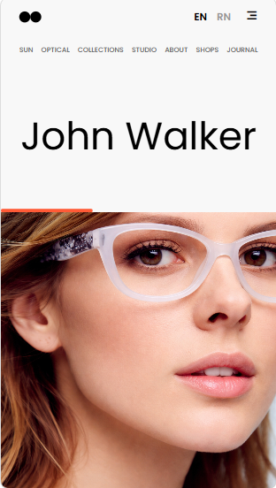

# Trendline Fashion Landing Page

This is a modern fashion-inspired landing page built using HTML and CSS.
The project focuses on horizontal scrolling sections, modern typography, smooth hover interactions, responsive layouts, and clean UI aesthetics.

## Features

* Fully responsive layout
* Horizontal scrolling text section
* Smooth hover animations
* Interactive navigation hover effects
* Modern fashion-style UI
* Scrollable image gallery
* Custom scrollbar styling
* Clean typography and spacing
* Mobile-friendly design

## Technologies Used

* HTML5
* CSS3
* Remix Icons
* Google Fonts
* Git & GitHub

## Folder Structure

```bash
trendline-fashion-landing-page/
├── index.html
├── style.css
├── README.md
│
├── Images/
│   ├── hero-image-1.png
│   ├── hero-image-2.png
│   ├── hero-image-3.png
│   ├── desktop-preview.png
│   └── mobile-preview.png
```

## Screenshots

### Desktop View



### Mobile Responsive View



## Demo Video

[Watch Demo Video](https://drive.google.com/file/d/1oqAhxzwPHgOpfkWauza-966Bq10rrZw8/view?usp=drive_link)

## How to Run

1. Clone the repository:

```bash
git clone https://github.com/kenil948/trendline-fashion-landing-page.git
```

2. Open `index.html` in your browser.

## Live Demo

Check it out here:

https://kenil948.github.io/trendline-fashion-landing-page/

## What I Learned

* Horizontal Scrolling Layouts
* Responsive Web Design
* CSS Hover Effects
* Scrollbar Customization
* Flexbox Layout Structuring
* Modern Typography Usage
* Building Fashion-Style Interfaces
* Mobile Responsive Adjustments
* GitHub Deployment Workflow

## Notes

This is a frontend practice project created for learning and improving UI/UX and frontend development skills.
